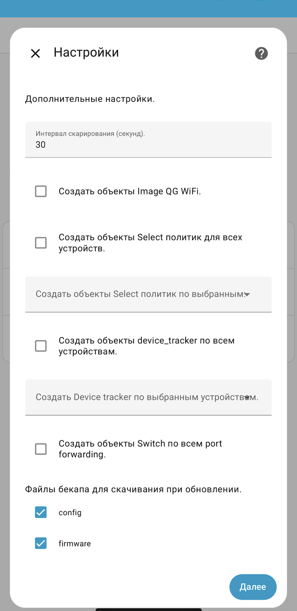

# 🧠 Компонент Home Assistant для роутеров Keenetic

Интеграция для Home Assistant, которая предоставляет полный контроль и мониторинг вашего роутера Keenetic через его API. Превратите ваш роутер в умное устройство с широким набором сенсоров, переключателей и сервисов.

## ✨ Возможности

Интеграция создает множество сущностей для полного управления роутером:

### 📊 Мониторинг системы
*   **Сенсоры:** Загрузка CPU и памяти, время работы (uptime), WAN IP-адрес, температура чипов 2.4 ГГц и 5 ГГц, количество клиентов Wi-Fi.
*   **Бинарный сенсор:** Общий статус роутера.

### 🌐 Управление сетью и интерфейсами
*   **Трекер устройств:** Отслеживание подключенных клиентов.
*   **Сенсоры интерфейсов:** Скорость загрузки/выгрузки, объем переданных данных, время включения.
*   **Бинарные сенсоры:** Статус подключения интерфейса.
*   **Переключатели:** Включение/отключение интерфейсов.

### ⚙️ Управление функциями роутера
*   **Кнопка:** Перезагрузка роутера.
*   **Переключатели:** Управление питанием USB-портов, доступом к веб-конфигуратору, пробросом портов.
*   **Селектор:** Выбор политики для клиента.
*   **Обновление:** Проверка и установка обновлений прошивки.

### 🖼️ Прочее
*   **Изображение:** Генерация QR-кода для вашей Wi-Fi сети.

### 🔧 Сервисы
*   `keenetic_api.request_api`: Прямой запрос к API роутера для расширенного управления.
*   `keenetic_api.backup_router`: Создание резервной копии конфигурации.

**Полная таблица объектов:**

| Домен | Объект | Описание |
| :--- | :--- | :--- |
| `binary_sensor` | Status | Статус роутера |
| `button` | Reboot | Кнопка перезагрузки |
| `device_tracker` | Device tracker client | Трекер подключенных устройств |
| `image` | QR WiFi | QR-код Wi-Fi сети |
| `select` | Policy client | Выбор политики для клиента |
| `sensor` | CPU load | Загрузка процессора |
| `sensor` | Memory load | Загрузка памяти |
| `sensor` | Uptime | Время работы (аптайм) |
| `sensor` | WAN IP adress | WAN IP-адрес |
| `sensor` | Temperature 2.4G Chip | Температура чипа 2.4 ГГц |
| `sensor` | Temperature 5G Chip | Температура чипа 5 ГГц |
| `sensor` | Clients wifi | Количество клиентов Wi-Fi |
| `switch` | Usb power port | Управление питанием портов USB |
| `switch` | Web configurator access | Управление доступом к веб-конфигуратору |
| `switch` | Interface | Управление интерфейсами |
| `sensor` | Interface start up time | Время включения интерфейса |
| `sensor` | Interface downlink speed | Скорость загрузки интерфейса |
| `sensor` | Interface downloaded | Загружено по интерфейсу |
| `sensor` | Interface uplink speed | Скорость выгрузки интерфейса |
| `sensor` | Interface uploaded | Выгружено по интерфейсу |
| `binary_sensor` | Interface connection | Состояние интерфейса |
| `switch` | Port Forwarding | Управление пробросом портов |
| `update` | Update router | Обновление прошивки |

---

## 📦 Установка

### Рекомендуемый способ: Через HACS

1.  Откройте **HACS** в вашем Home Assistant.
2.  Перейдите в раздел **Интеграции**.
3.  Нажмите на кнопку с тремя точками в правом верхнем углу и выберите **Пользовательские репозитории**.
4.  Вставьте URL этого репозитория: `https://github.com/malinovsku/ha-keenetic_api`
5.  Выберите категорию **Интеграция** и нажмите **Добавить**.
6.  Теперь в магазине HACS найдете интеграцию **Keenetic API** и нажмите **Загрузить**.
7.  **Перезагрузите** сервер Home Assistant.

### Альтернативный способ: Ручная установка

1.  Скачайте последнюю версию архива со вкладки [Releases](https://github.com/malinovsku/ha-keenetic_api/releases).
2.  Распакуйте содержимое архива.
3.  Скопируйте папку `keenetic_api` в директорию `config/custom_components` вашего Home Assistant.
4.  **Перезагрузите** сервер Home Assistant.

## ⚙️ Настройка

1.  После перезагрузки перейдите в **Настройки** -> **Устройства и службы**.
2.  Нажмите кнопку **Добавить интеграцию** и найдите **Keenetic API**.
3.  Следуйте инструкциям мастера настройки:
    *   **Хост/IP:** Адрес вашего роутера Keenetic (например `http://192.168.1.1` или `https://myrouter.local`).
    *   **Учетные данные:** Имя пользователя и пароль администратора роутера.
4.  После успешного добавления вы можете выбрать, какие объекты создавать, в дополнительных настройках интеграции.

<p align="center">
    
</p>

## 🔌 Использование сервисов

### Сервис `keenetic_api.request_api`

Универсальный сервис для выполнения прямых запросов к API роутера Keenetic. Позволяет использовать любую команду, доступную через `/webcli/rest`. Результат возвращается в панели разработчика и может быть использован в автоматизациях и шаблонах.

**Параметры сервиса:**

| Параметр | Обязательный | Описание | Пример |
| :--- | :--- | :--- | :--- |
| `device_id` | Нет | ID устройства роутера в Home Assistant. | `router_keenetic_1234` |
| `entry_id` | Нет | ID записи интеграции в Home Assistant. | `1234567890abcdef` |
| `method` | **Да** | HTTP-метод (`GET`, `POST`, `PUT`, `DELETE`). | `POST` |
| `endpoint` | **Да** | Конечная точка API. | `/rci/show/interface/WifiMaster0` |
| `data_json` | Нет | Данные для отправки в формате JSON. | `{"show": {"system": {}}}` |

**Пример вызова через YAML:**
```yaml
service: keenetic_api.request_api
data:
  device_id: router_keenetic_1234
  method: POST
  endpoint: /rci/
  data_json: {"show": {"system": {}}}
```

## 🧩 Создание кастомных сенсоров

С помощью сервиса `keenetic_api.request_api` можно создавать собственные сущности на основе шаблонов ([Template platforms](https://www.home-assistant.io/integrations/template/)).

**Пример создания сенсора загрузки канала Wi-Fi:**

```yaml
template:
  - trigger:
      - platform: time_pattern
        seconds: "/30"
    action:
      - service: keenetic_api.request_api
        data:
          device_id: my_device_id_keenetic
          method: POST
          endpoint: /rci/
          data_json: {"show": {"interface": {"channel-utilization": {"chart": {"name": "WifiMaster0", "detail": 0}}}}}
        response_variable: r
    sensor:
      - name: "Channel Utilization WifiMaster0"
        unique_id: "channel_utilization_wifimaster0"
        state: >
          {{ r.response.show.interface['channel-utilization'].chart.data[-1].v.load }}
        unit_of_measurement: "%"
```

---

## ⭐ Поддержка проекта

Если этот проект сделал ваш умный дом еще умнее, поставьте звезду ⭐ на GitHub! Это лучшая мотивация для дальнейшего развития.

**Осторожно:** Использование сервиса `request_api` требует понимания API Keenetic. Неправильные запросы могут повлиять на работу сети.